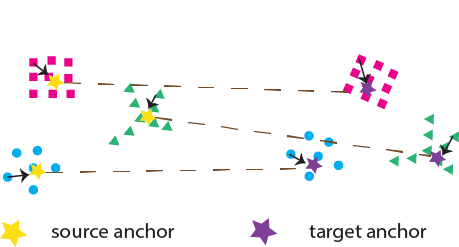
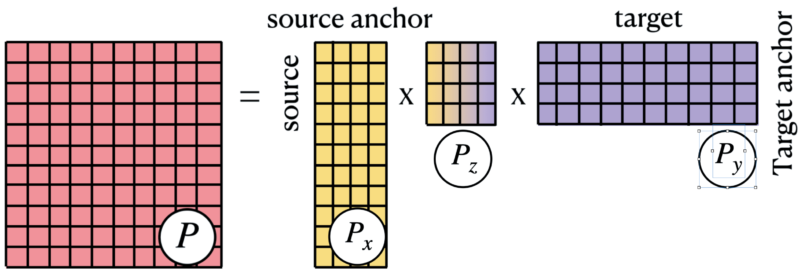
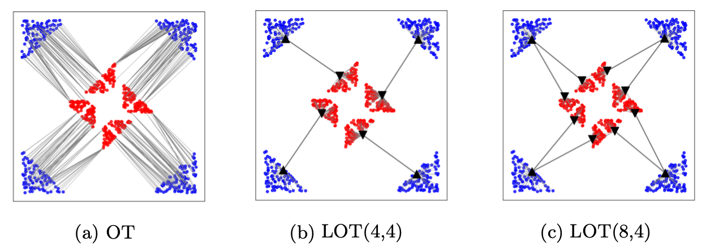
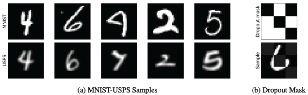
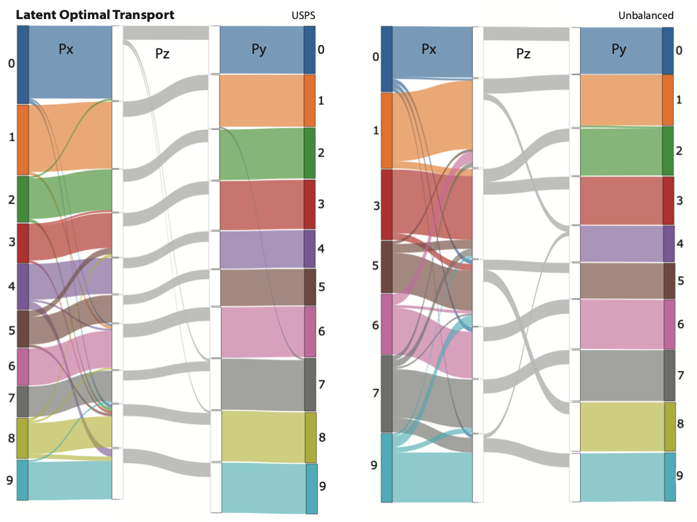

## Making transport more robust and interpretable by moving data through a small number of anchor points

## Abstract
Optimal transport (OT) is a widely used technique for distribution alignment, with applications throughout the machine learning, graphics, and vision communities. Without any additional structural assumptions on transport, however, OT can be fragile to outliers or noise, especially in high dimensions. Here, we introduce Latent OptimalTransport (LOT), a new approach for OT that simultaneously learns low-dimensional structure in data while leveraging this structure to solve the alignment task.  The idea behind our approach is to learn two sets of “anchors” that constrain the flow of transport between a source and target distribution. In both theoretical and empirical studies, we show thatLOTregularizes the rank of transport and makes it more robust to outliers and the sampling density. We show that by allowing the source and target to have different anchors, and using LOT to align the latent spaces between anchors,  the resulting transport plan has better structural interpretability and highlights connections between both the individual data points and the local geometry of the datasets.

## Method
The main idea behind LOT is to factorize the transport plan into three components, where mass is moved: (i) from individual source points to source anchors, (ii) from the source anchors to target anchors, and (iii) from target anchors to individual target points. This is illustrated in Figure 1.


**Figure 1: A transport consists of moving mass from the data to anchors, and the anchors to anchors**

To translate the idea into mathematics, we propose the Latent Optimal Transport (LOT ) which solves the following optimization.


The output transport is low-rank and decomposed into 3 pieces shown in Figure 2.

%20\mathbf{P}_{z}%20\operatorname{diag}\left(\mathbf{v}_{z}^{-1}\right)%20\mathbf{P}_{y})



**Figure 2: The factored plan decomposes into 3 compoenents. The outer 2 pieces represents the clustering of data, and the inner piece represents the alignment of data.**

By using number of anchors as a free hyperparameters for the source and target, LOT is able to capture different kinds of structures. An example is shown in Figure 3.


**Figure 3: Comparison of transport plans obtained for different methods applied to clustered data**

## Results
The low-rank decomposition in LOT allowed us to visualize transport between the source to anchors and then from anchors to the target again. This highlights the interpretability of our approach, with the middle transport plan Pz providing a concise map of interactions between class manifolds. 

We show this in a setting where LOT is used to fix domain shift introduced in a MNIST-trained network by infering over (i) the USPS dataset (ii) a subset of MNIST (digits 2, 4, 8 removed - unbalanced transport) that is perturbed using a corase dropout transformation.

LOT succesfully bridges the gap by aligning the source and target distributions, and we can see in figure 2 how the class manifolds are being transpored to their correct correspondant, even in the unbalanced case.




**Figure 4: (Top) Examples of MNIST-USPS samples and dropout mask. (Bottom) Visualization of transport of handwritten digits**

## Citation

```bibtex
@InProceedings{lin2021,
  title = 	 {Making transport more robust and interpretable by moving data through a small number of anchor points},
  author =       {Lin, Chi-Heng and Azabou, Mehdi and Dyer, Eva},
  booktitle = 	 {Proceedings of the 38th International Conference on Machine Learning},
  pages = 	 {6631--6641},
  year = 	 {2021},
  editor = 	 {Meila, Marina and Zhang, Tong},
  volume = 	 {139},
  series = 	 {Proceedings of Machine Learning Research},
  month = 	 {18--24 Jul},
  publisher =    {PMLR},
}
```
